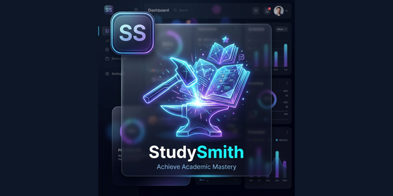
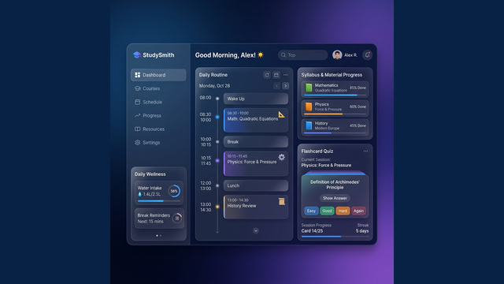
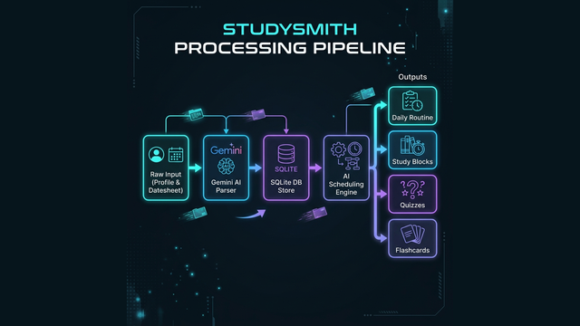
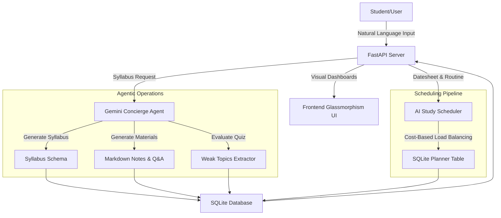
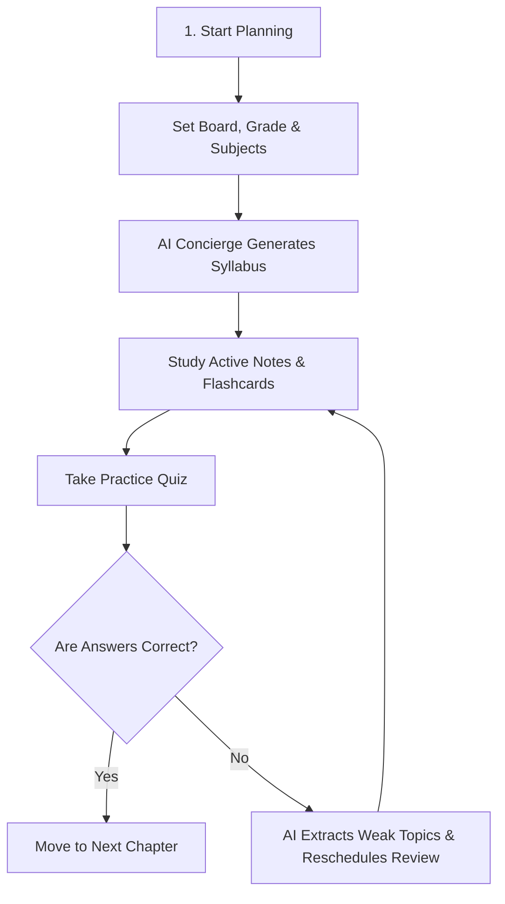

# StudySmith: Smart Student Planner & Scheduler (Concierge Track)
### *Your Autonomous Academic Concierge — Transforming Curriculum Complexity into Effortless Academic Success*

<p align="center">
  
</p>

---

**StudySmith** is an autonomous AI student planner and scheduler built for the Google AI Agents Capstone Project. It acts as an academic concierge that translates syllabus files, exam datesheets, and daily routines into highly personalized study schedules, revision plans, and interactive learning aids using natural language. By taking the friction out of educational planning, StudySmith empowers students to focus entirely on learning while the agent dynamically manages the cognitive load of scheduling, tracking, and content curation.

<p align="center">
  
</p>

---

## 🚀 Key Agentic Features

StudySmith leverages a combination of structured output schemas and heuristic load balancing to behave as a true concierge agent:

*   📅 **Proactive Exam Scheduling**: Instead of requiring manual input of exam events, students can paste their raw datesheet texts in natural language. The agent extracts, structures, and generates a chronologically structured exam timeline automatically.
*   🔄 **Dynamic Load-Balanced Rescheduling**: When plans change or weak areas are discovered, StudySmith automatically adjusts study blocks. It balances high-impact tasks (detailed notes, active recall flashcards, practice quizzes) across available days using a cost-based optimization formula to prevent exam-eve cramming.
*   🧠 **Context & Preference Retention**: The agent remembers the student's board/curriculum, current grade, academic stream, and selected subjects. Subsequent syllabus generation, revision notes style, and practice questions remain perfectly tailored to these preferences over time.
*   🎯 **Targeted Weakness Remediation**: Upon completing a generated chapter quiz, the agent automatically evaluates incorrect responses using structured JSON formatting to pinpoint weak subtopics and queue up targeted revision tasks.

---

## 🔄 How It Works: The Processing Journey

StudySmith simplifies complex student logistics by transforming chaotic inputs into organized, structured learning plans:

| Phase 1: Chaos Ingestion | Phase 2: Organized Success |
| :---: | :---: |
|  |  |
| **From Chaos...** Students paste raw, unstructured datesheets, handwritten notes, and curriculum subjects in natural language. | **...To Structured Clarity** The agent processes tasks through standard JSON schemas and dynamically builds the load-balanced study schedule. |

---

## 🛠️ Tech Stack & Architecture

StudySmith combines modern agentic frameworks with a robust, lightweight backend and a responsive user interface:

### The Core Course Stack
*   **Google ADK 2.0 / `google-genai` SDK**: Powers structured JSON schema generation and natural language parsing.
*   **Antigravity IDE**: Used for developer environment workspace management, code generation, and rapid iteration.
*   **agents-cli**: Utilized to interface, debug, and run command-line agent loops during prototyping.
*   **Gemini 1.5 & 2.5 Ecosystem**: The underlying model pipeline (utilizing `gemini-2.5-flash` and `gemini-1.5` compatible structural endpoints) provides deterministic JSON responses for syllabus design, quiz evaluation, and study materials generation.

### System Architecture & Workflow Graph


### Adaptive Learning User Flow


1.  **Routing & Processing**: User requests (profile customization, syllabus generation, exam datesheet extraction) are received by a FastAPI gateway.
2.  **Syllabus & Material Synthesis**: If no local records exist, the Gemini agent leverages Pydantic schemas to generate official board-specific syllabi and markdown study materials on-the-fly.
3.  **Heuristic Cost-Based Scheduling**: Study tasks are automatically spread across the timeline between today and the target exam date, balancing cognitive load (hard vs. easy tasks) and minimizing day-to-day work peaks.

---

## 💻 Local Setup & Installation

Follow these steps to run StudySmith on your local machine.

### Prerequisites
*   Python 3.10 or higher installed.
*   Google Cloud SDK / `gcloud` installed (optional, for ADC auth).

### 1. Clone & Navigate to the Repository
```bash
git clone <repository-url>
cd CAPSTONE
```

### 2. Set Up the Backend Environment
Create a Python virtual environment and install all backend requirements:
```bash
# Create virtual environment
python -m venv backend/.venv

# Activate virtual environment
# On Windows:
backend\.venv\Scripts\activate
# On macOS/Linux:
source backend/.venv/bin/activate

# Install dependencies
pip install -r backend/requirements.txt
```

### 3. Configure Authentication
To allow the application to query the Gemini models, configure your credentials using either of the following standard developer methods:

#### Option A: Set Environment Variable (Recommended for local dev)
Create a `.env` file inside the `backend/` directory:
```env
GEMINI_API_KEY=your_gemini_api_key_here
JWT_SECRET=your_custom_jwt_signing_secret_here
```
> [!IMPORTANT]
> Ensure `.env` is added to your `.gitignore` file. Never commit active, private API keys to version control.

#### Option B: Application Default Credentials (ADC)
If you have Google Cloud SDK configured, authenticate using your Google User Credentials:
```bash
gcloud auth application-default login
```

### 4. Run the Application
Start the FastAPI server (it will automatically serve the static web application frontend at `http://127.0.0.1:8000/`):
```bash
# Navigate to backend directory if not already there
cd backend

# Launch the server
uvicorn main:app --reload
```

Open your browser and navigate to `http://127.0.0.1:8000/` to log in, register, and begin planning your study journey.

### 5. Running Tests
You can verify the backend endpoints and AI flows by running the built-in test client script:
```bash
python test_backend.py
```

---

## 🔮 Future Scope

As we transition StudySmith from a hackathon prototype into a production-ready student application, our future roadmap includes:

*   ☁️ **Cloud Database Integration**: Migrating the local SQLite relational model to Google Cloud Firestore for real-time schedule syncing and multi-device support.
*   🔐 **Enterprise-Grade Identity**: Implementing Google Identity Platform OAuth 2.0 for secure, single-sign-on (SSO) login.
*   ⚡ **Automated CI/CD Pipeline**: Setting up GitHub Actions that build dockerized images of the FastAPI application and deploy automatically to Google Cloud Run upon code commits.
*   🔔 **Proactive Messaging Integrations**: Adding WhatsApp and Telegram notification agents to notify students of upcoming high-priority study blocks or hydration breaks.
# STUDYSMITH

# STUDYSMITH

# STUDYSMITH

# STUDYSMITH

